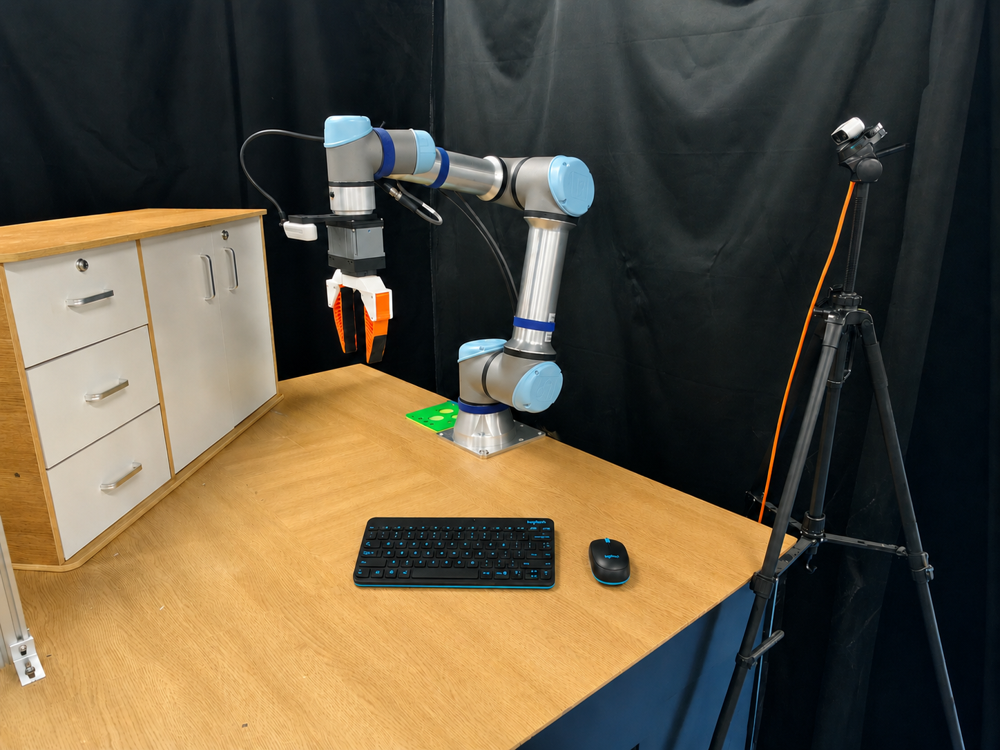
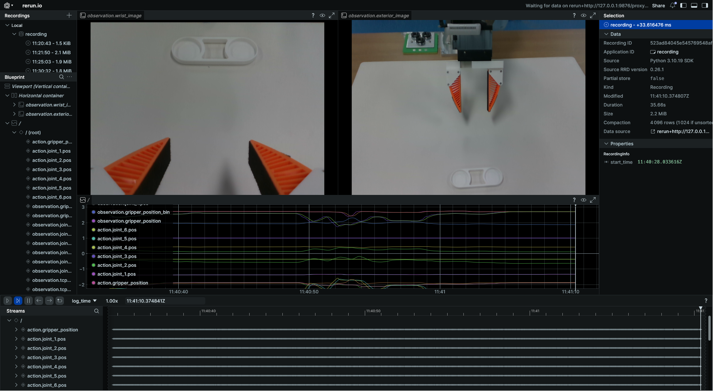
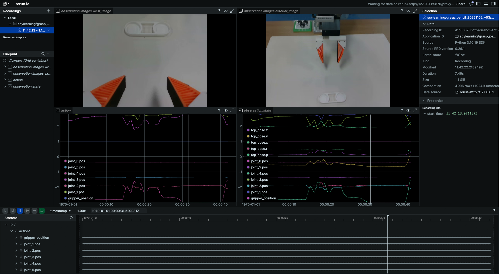
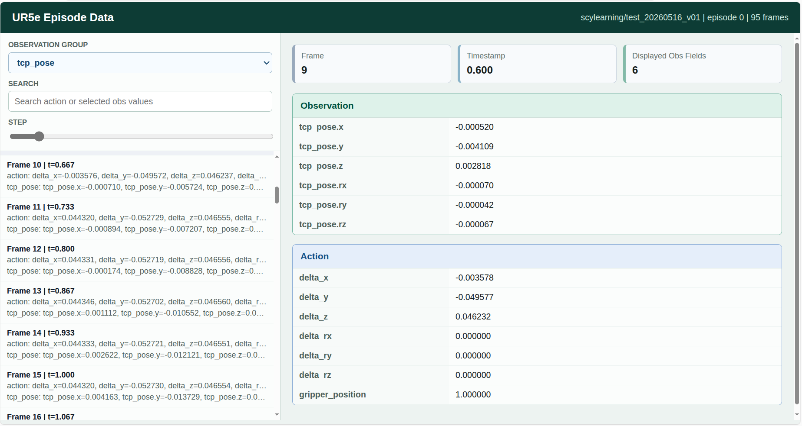

# UR5e 键盘遥操作数据采集与回放指南

<p align="center">
  
  <br>
</p>

## 1. 环境配置

### 1.1 创建并激活 conda 环境
```bash
conda create -n ur_data python=3.10
conda activate ur_data
```

### 1.2 安装 lerobot
```bash
# 安装指定版本 0.3.4
git clone https://github.com/huggingface/lerobot.git
cd lerobot
git checkout da5d2f3e9187fa4690e6667fe8b294cae49016d6
pip install -e .
```

### 1.3 克隆并安装 UR5e 键盘遥操作源码
```bash
mkdir ur_data_collection && cd ur_data_collection
git clone https://github.com/scy-v/lerobot_ur5e_keyteleop.git
cd lerobot_ur5e_keyteleop
pip install -r requirements.txt # 以可编辑形式安装所有包
```

### 1.4 查看可运行的命令
运行以下命令以查看所有可用的脚本：
```bash
ur5e-help
# ==================================================
#  UR5e Keyboard Teleoperation Utilities
# ==================================================
#
# Core Commands:
#   ur5e-record       Record keyboard teleoperation dataset
#   ur5e-replay       Replay a recorded dataset
#   ur5e-visualize    Visualize recorded dataset
#
# Tool Commands:
#   tools-check-dataset   Check local dataset integrity
#   tools-check-info      Check local dataset information
#   tools-check-rs        Retrieve connected RealSense camera serial numbers
#   tools-prune-dataset   Prune episodes from dataset by Episode ID
#   tools-robot-state     Read and print robot state once
#
# Shell Tools:
#   map_gripper.sh        Map Gripper Serial Port
#
# Test Commands:
#   test-gripper-ctrl     Run gripper control command
#
# --------------------------------------------------
#  Tip: Use 'ur5e-help' anytime to see this summary.
# ==================================================
```

## 2. 获取和配置必要参数

### 2.1 获取 RealSense 相机序列号
请确保每次仅连接一个相机：
```bash
tools-check-rs
```

### 2.2 固定夹爪串口映射
例如，将夹爪映射到 `/dev/ur5e_left_gripper`。执行此操作前，请确保仅连接一个夹爪 USB 设备：
```bash
map_gripper.sh ur5e_left_gripper
```
随后，将设定的映射值填入 `cfg.yaml` 中的 `gripper_port` 字段。

### 2.3 配置键盘遥操作和机器人参数
打开 `scripts/config/cfg.yaml` 文件，检查机器人 IP、夹爪串口、相机序列号、控制模式、复位位姿、负载和键盘步长等参数。

关键机器人字段：
- `control_space`：`"position"` 或 `"force"`。
- `reference_frame`：`"base"` 或 `"tcp"`。
  - `base`：action 增量在 base 坐标系下表达，`tcp_pose` 观测为绝对位姿。
  - `tcp`：action 增量在当前 TCP 坐标系下表达，`tcp_pose` 观测为相对 episode 参考位姿的变化量。
- `init_pose`：复位 TCP 位姿 `[x, y, z, rx, ry, rz]`。
- `init_pos_range`：复位位置 `[x, y, z]` 的随机范围。
- `teleop.position_step_size`：position 控制下的键盘平移增量。
- `teleop.force_step_size`：force 控制下的键盘平移增量。
- `teleop.position_rot_step_size`：position 控制下的键盘欧拉角增量。
- `teleop.force_rot_step_size`：force 控制下的键盘欧拉角增量。

## 3. 数据集记录

### 3.1 上传数据到 Hugging Face（可选）
1. 在 `cfg.yaml` 中设置：
```yaml
push_to_hub: True
```
2. 获取 Hugging Face 账号的 token 并登录：
```bash
huggingface-cli login --token ${HUGGINGFACE_TOKEN}
huggingface-cli whoami  # 检查是否登录成功
```

### 3.2 开始记录
1. 打开 UR5e 示教器上的 **Remote Control**。
2. 确认 `cfg.yaml` 中参数配置正确。
3. 为了确保数据收集过程规范，请先阅读 `10. 数据集命名与记录详解` 以了解数据记录细节，然后再运行以下命令：
```bash
ur5e-record
```

<p align="center">
  
  <br>
  <b>Figure 1: Record</b>
</p>

## 4. 数据集回放
```bash
ur5e-replay # 注意 cfg 配置
```

## 5. 数据集可视化
```bash
ur5e-visualize # 注意 cfg 配置
```

| 可视化 | Episode 数据窗口 |
|:------:|:----------------:|
|  |  |
| **Figure 2: Visualization** | **Figure 3: Episode Data Window** |

Episode 数据窗口会显示每一帧的完整 action，并支持选择单个 observation 组进行查看，例如 `tcp_pose`、`tcp_force` 或各关节状态。

## 6. 数据集追加与恢复
如果你已经在指定的 `repo_id` 下录制过数据集，可以在 `cfg.yaml` 中将 `resume` 设置为 `True`，并在 `resume_dataset` 中填写要追加的数据集名称，以便在现有数据集的基础上继续录制。然后运行以下命令：

```bash
ur5e-record
```

## 7. 数据集合并
如果你在不同阶段分别录制了数据集，请确保各阶段的数据集具有不同的 `repo_id`。完成录制后，可通过以下命令将它们合并为一个数据集：
```bash
lerobot-edit-dataset \
    --repo_id <merged_repo_id> \
    --operation.type merge \
    --operation.repo_ids "['<repo_id_1>', '<repo_id_2>']"
```
- 更多数据集处理命令，请参考 [LeRobot](https://huggingface.co/docs/lerobot/using_dataset_tools)。

## 8. 数据集检查与裁剪
- 使用以下命令检查数据集读取是否正确，尤其是视频帧缺失情况。
- 注意修改 `cfg.yaml` 中的 `check_dataset.dataset_name`。
```bash
tools-check-dataset
```
- 若发现视频帧缺失，可运行以下命令生成新数据集，同时保留原数据集，新数据集会删除指定的 `episode ID`。
- 注意修改 `cfg.yaml` 中的 `prune_episodes.old_dataset_name` 和 `prune_episodes.new_dataset_name`。
```bash
tools-prune-dataset "[id1,...,idN]"
```
- 该工具可删除视频帧缺失以及任意指定的 episode。

## 9. 录制控制按键说明

### 9.1 Episode 控制按键
1. **右方向键**
   1. 按下右方向键：结束当前 episode 的录制并保存数据，程序将暂停等待。
   2. 进入**复位**阶段：按回车键以继续，机器人会复位到 `cfg.yaml` 中配置的初始 TCP 位姿。
   3. 再次按下右方向键，开始录制下一个 episode。

2. **左方向键**
   - 按下后：重新开始当前 episode 的录制，并覆盖当前 episode 缓存。

3. **Esc 键**
   - 按下后：退出整个录制任务，并保存当前已录制的数据。

4. **Ctrl+C 或抛出异常**
   - 按下或发生异常时：自动进入异常处理阶段，提示用户是否删除当前未完成的录制数据。

### 9.2 键盘遥操作按键
| 按键 | 动作 |
|:---:|:-----|
| `w` / `s` | x 负方向 / 正方向移动 |
| `a` / `d` | y 负方向 / 正方向移动 |
| `q` / `e` | z 正方向 / 负方向移动 |
| `r` / `t` | rx 正方向 / 负方向旋转 |
| `g` / `f` | ry 正方向 / 负方向旋转 |
| `b` / `v` | rz 正方向 / 负方向旋转 |
| `o` | 夹爪保持打开 |
| `l` | 夹爪保持闭合 |

## 10. 数据集命名与记录详解

### 10.1 数据集命名

<p align="center">
  
  <br>
  <b>Figure 4: Dataset</b>
</p>

<p align="center">
  
  <br>
  <b>Figure 5: Dataset Info</b>
</p>

1. 数据集默认保存在 `~/.cache/huggingface/lerobot` 目录下，包含三类内容：

   - `dataset_info.txt`：自动记录本地数据集信息，包括以下字段：`record_id`、`name`、`task`、`date`、`version`、`user_info` 和 `type`。其中，`user_info` 可以通过 `cfg.yaml` 中的 `user_notes` 进行注解。

   - `dataset_info_backup`：当通过 `tools-check-dataset` 手动更新 `dataset_info.txt` 时，保存旧的记录备份。

   - 数据集文件夹：存放实际的数据集内容。

2. 数据集命名格式为 `[description]_[date]_[version]`。其中：
   - `description` 来源于 `cfg.yaml` 中的 `repo_id=<user_name>/<description>`；
   - `date` 会自动生成；
   - `version` 会根据是否存在同名数据集（`repo_id` 相同）自动生成新版本号。

3. description 命名规则：`task.description -> Verb_SourceObject_prep_TargetObject`。
   即将 `cfg.yaml` 中的 `task.description` 按照上述格式映射生成。例如：
   `Pick up the green cube and put it into the trash bin -> pick_greencube_into_trashbin`。

### 10.2 数据记录说明
1. 完成步骤 `2. 获取和配置必要参数`。
2. 根据任务内容，在 `cfg.yaml` 的 `task.description` 中填写指令，并根据数据集命名规则设置 `repo_id`。
3. 检查并调整 `cfg.yaml` 中的其他参数，确保配置正确。
4. 运行命令 `ur5e-record`。机器人会在录制前复位到 `init_pose`，并在每个 episode 正式开始时设置新的 episode 参考位姿。
5. 数据记录结束后，数据集同级目录会生成 `dataset_info.txt` 文件，用于保存本地数据集信息。如果手动删除过数据集，可通过以下命令更新记录信息：
```bash
tools-check-info
```
